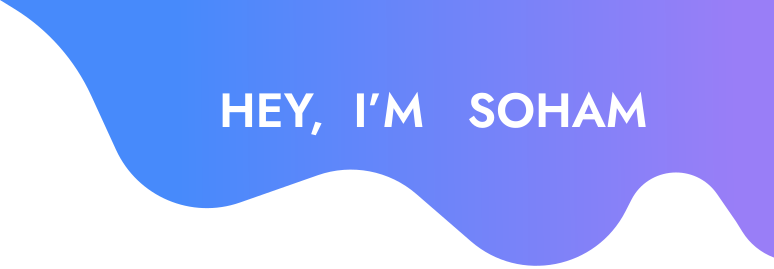
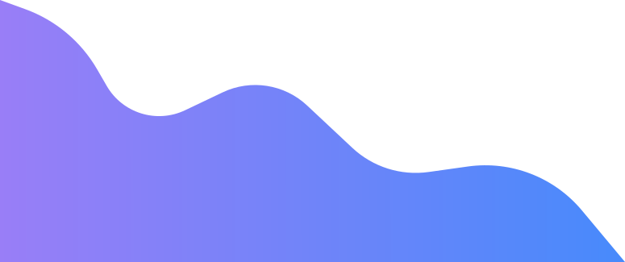

 

# 💫 About Me:
👋 Hi, I’m Soham 👀 I’m interested in C,C++,JS,JAVA,ML 🌱 I’m currently learning Web Development 💞️ I’m looking to collaborate on Web development projects focused on creating intuitive, user-centered designs. 😄 Pronouns: He/Him ⚡ Fun fact: I’m passionate about blending creativity with tech—whether it’s through UI design or gaming!

# 💻 Tech Stack:
   

  
# 📊 GitHub Stats:
 
 

  ## 🌐 Socials:
  
  
  
  

## 🏆 GitHub Trophies

---

